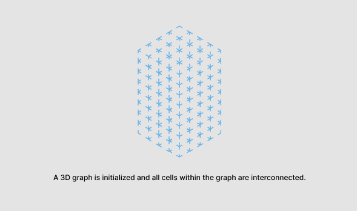
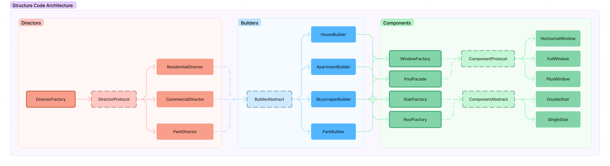

====================
Structure Overview
====================

*2 min read*

**Scenario**

- The metropolis is a vast and complex entity comprising many structures distinguished by an array of architectural variations. From towering skyscrapers to picturesque parks, the cityscape is a testament to the diversity of human ingenuity.
- In this context, the 'structure' submodule was devised with the purpose of centralising the creation of all types of urban structures, from recreational spaces to medical facilities and residential quarters.

**Challenge 1 ~ Structure Generation**

- The uncoordinated generation of structures can lead to a chaotic codebase that is hard to maintain and extend, thereby hindering the ability to support new structures.
- Thus, the task was to craft a centralised and robust generation engine that could produce a diverse set of structures that could accommodate the myriad types of urban edifices.

**Solution 1 ~ 3D Graphs**

- To meet this challenge, we employed the use of 3D graphs, where cells, the smallest unit of buildable space, are interconnected to form a three-dimensional representation of the build area.
- During the generation process, traversed cells are transformed into a generative type, and this traversal can be modified using a lambda predicate. This feature is vital in enabling the generator to function for a wide range of structures.
- Examples of this implementation include:

  - Traversing upwards to create a **spire for a skyscraper**
  - Traversing in a column to create a **grand hallway in a library**
  - Traversing on "level_access" cell types to create a **grand spiral staircase**
  - Traversing only on a level above the ground level to create a **high-ceilinged hotel lobby**.

**Challenge 2 ~ Modularity, Extensibility, and Reusability**

- To ensure the submodule's flexibility, it was imperative to enable contributors to add their own custom structures to the codebase easily. However, despite their architectural variations, buildings share common properties such as walls, roofs, and doors.
- Without a cohesive submodule framework, each addition would be plagued by convoluted access to internal APIs, an unorganised code structure, and unmaintainable code.

**Solution 2 ~ Design Patterns**

- To tackle this challenge, we made extensive use of various design patterns. A slightly modified builder structural pattern was utilised to register custom structures.
- This pattern comprises of a director which coordinates the build order and process using a builder. The builder defines customised component methods respective to the structure being built, and these components, such as doors, windows, and walls, are then used to build the structure.
- This framework allowed the heavy reuse of components. For example, a library and a skyscraper can call the same underlying wall component.
- Likewise, builders may reuse the same director type. For example, a townhouse and an apartment building may reuse the overlying residential director.
- Additionally, protocol and abstract classes were employed to enforce maintainability and extensibility, and where necessary, directors, builders, and components were abstracted away behind abstract factories, factories, and facades.
- This framework allowed us to simplify object creation while enhancing extensibility greatly. More importantly, focusing on code reusability allowed for a concise and readable codebase.

Many other nuances to the submodule have been omitted in this overview, such as the optimisation of computation by drawing traversed cells only when required. However, if you want to contact me ~ contact(atsign)kindaraffy.xyz :).
